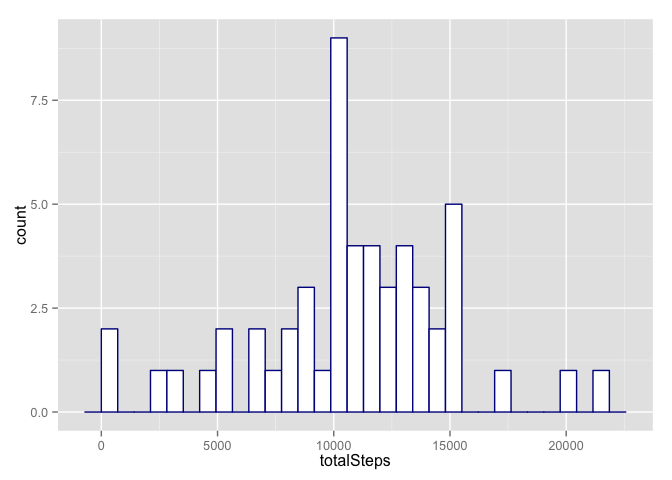
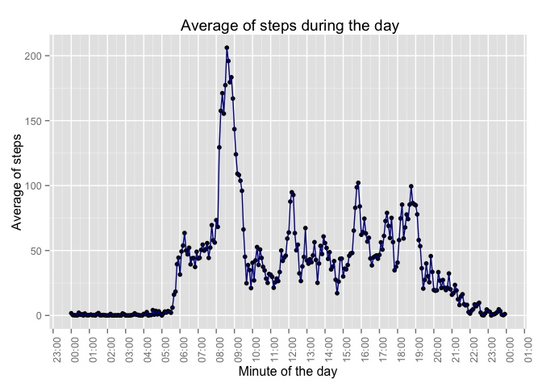
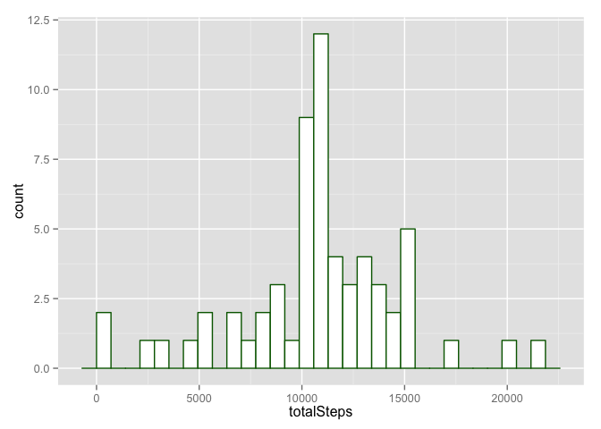
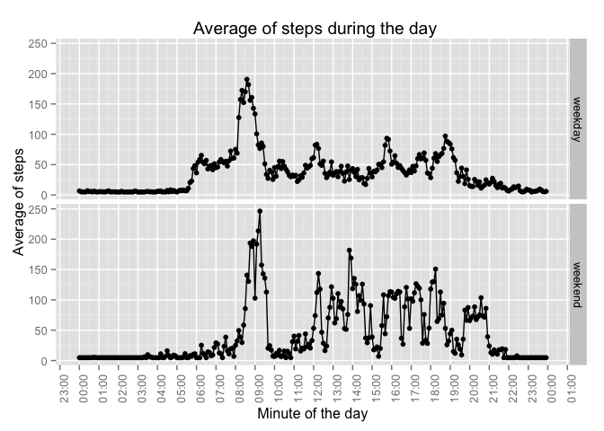

# Reproducible Research: Peer Assessment 1

## Dependencies

- Required R packages:
* knitr 
* ggplot2 
* dplyr


## Loading and preprocessing the data

The variables included in this dataset are:

- **steps**: Number of steps taking in a 5-minute interval (missing values are coded as `NA`)
- **date**: The date on which the measurement was taken in YYYY-MM-DD format
- **interval**: Identifier for the 5-minute interval in which measurement was taken. The value in base 60 representing hours and minutes (hhmm)

The dataset is stored in a comma-separated-value (CSV) file and there are a total of 17,568 observations in this dataset.


The [orignal Dataset](https://d396qusza40orc.cloudfront.net/repdata%2Fdata%2Factivity.zip) is downloaded, unzipped and loaded into the `activity` data.frame


```r
download.file(Dataset.Location,dest="data.zip",method="curl")
unzip(zipfile = "data.zip", overwrite=TRUE)
activity <- read.csv("activity.csv")
summary(activity)
```

```
##      steps                date          interval     
##  Min.   :  0.00   2012-10-01:  288   Min.   :   0.0  
##  1st Qu.:  0.00   2012-10-02:  288   1st Qu.: 588.8  
##  Median :  0.00   2012-10-03:  288   Median :1177.5  
##  Mean   : 37.38   2012-10-04:  288   Mean   :1177.5  
##  3rd Qu.: 12.00   2012-10-05:  288   3rd Qu.:1766.2  
##  Max.   :806.00   2012-10-06:  288   Max.   :2355.0  
##  NA's   :2304     (Other)   :15840
```


## What is mean total number of steps taken per day?

Using only `completeCases` the data is aggregated by `date` having the total number of `steps` by day


```r
completeCases <- activity[complete.cases(activity),]
stepsByDay <- aggregate(completeCases$steps,by=list(completeCases$date), FUN=sum)
names(stepsByDay) <- c("date","totalSteps")
```

There is a histogram of the total number of steps taken each day

 


In this dataset, supressing `NA` values, the **mean** and **median** values for the `totalSteps` per day are 1.076619\times 10^{4} and 10765 respectively.


## What is the average daily activity pattern?

The pattern will be described using a time series plot of the total steps by interval (5 minutes).


```r
stepsByInterval <- aggregate(completeCases$steps,by=list(completeCases$interval), FUN=mean)
names(stepsByInterval) <- c("interval","averageSteps")
```


This is the time series of the 5-minute interval (x-axis) and the average number of steps taken, averaged across all days (y-axis)

 


The 5-minute interval, on average across all the days in the dataset, contains the maximum number of steps is **08:35**

## Imputing missing values

In the original dataset there are 2304 rows with `NA` values in the `steps` column.

The values for this cases are calculated, and updated, using the **mean** for the same interval in complete cases.


```r
# This function is used in order to calculate the mean for an interval
intervalAvg <- function (itv) {
  mean(allCases$steps[allCases$interval == itv],na.rm=TRUE)
}

# A new data frame, with all cases is created
allCases <- activity

# steps are calculated, when missing, replacing NA by
# the mean in the same interval and not change for not NA
allCases <- within(allCases, 
                   steps <- ifelse(is.na(steps),
                                   intervalAvg(interval),
                                   steps))
```

Considering all cases and the values calculated for `NA`cases the histogram is :
 


In this new dataset, including the correction in the **steps** values ( 0 `NA` steps values), the **mean** and **median** values for the `totalSteps` per day are 1.076619\times 10^{4} and 1.0766189\times 10^{4} respectively.

## Are there differences in activity patterns between weekdays and weekends?

Two new columns are added to allCases data frame (the original activity data frame including a correction for `NA`values) :

* **weekday** contains the string with the week day name 
* **weekend** indicates if the day corresponds to a weekday or weekend (Saturday or Sunday)


```r
allCases["weekday"] <- weekdays(as.Date(allCases$date))
allCases["weekend"] <- ifelse(as.POSIXlt(allCases$date)$wday >=6,"weekend","weekday")
```

Using the **weekend** column it is possible to plot this graph representing different patterns for weekdays and weekend

 


